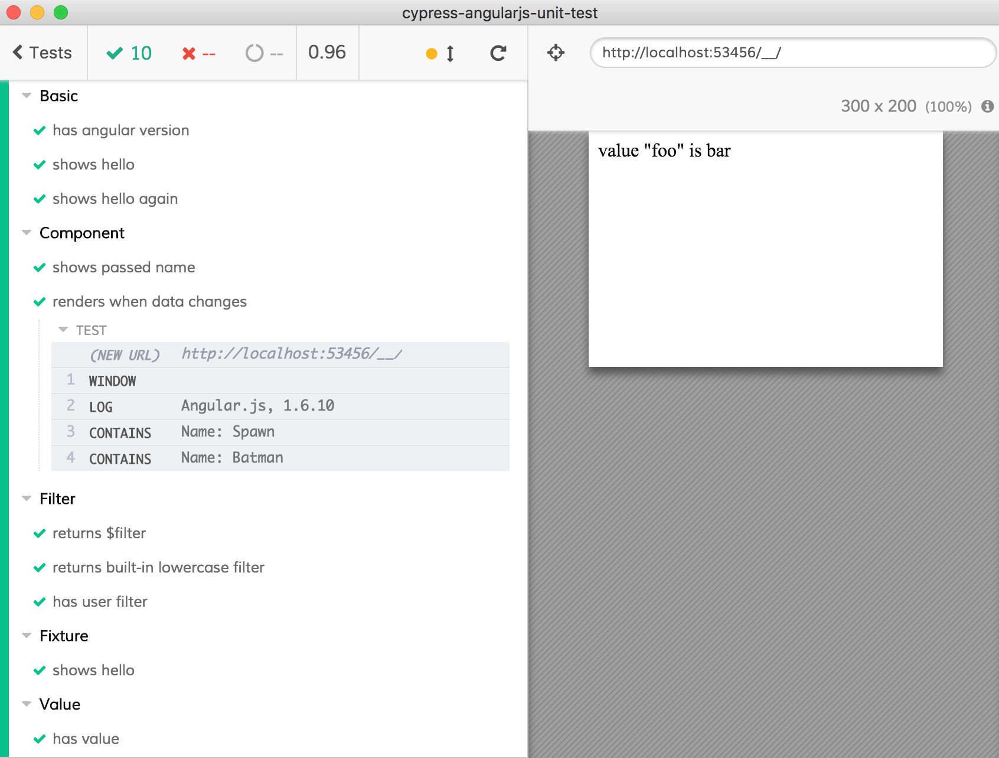

# cypress-angularjs-unit-test BETA

> Unit test Angularjs code using Cypress.io test runner

[![NPM][npm-icon]][npm-url]

[![Build status][ci-image]][ci-url]
[![semantic-release][semantic-image]][semantic-url]
[![standard][standard-image]][standard-url]
[![renovate-app badge][renovate-badge]][renovate-app]

## Motivation

You can use [Cypress.io](https://cypress.io) to end-to-end test any application, but what if you want to test your Angular.js values, services, controllers and components individually? This adaptor allows you to do this very quickly. See each test run as a mini app inside a real browser, go back in time using DOM snapshot, etc - all the good things [available in E2E tests are working in unit tests](https://www.cypress.io/blog/2018/04/02/sliding-down-the-testing-pyramid/).



## Install

Requires [Node](https://nodejs.org/en/) version 6 or above.

```sh
npm install --save cypress-angularjs-unit-test cypress
```

Requires `angular` peer dependency

## Use

```js
import {mount} from 'cypress-angularjs-unit-test'
// or const mount = require('cypress-angularjs-unit-test').mount
import angular from 'angular'
// prepare app
it('works', () => {
  const template = '... HTML template ... '
  const modules = ['module1', 'module2', '...']
  mount(template, modules)
})
```

### Basic example

See [cypress/integration/basic-spec.js](cypress/integration/basic-spec.js)

```js
import {mount} from 'cypress-angularjs-unit-test'
import angular from 'angular'

angular.module('demo', [])
  .controller('WelcomeController', function($scope) {
    $scope.greeting = 'Welcome!';
    $scope.version = angular.version.full
  });

beforeEach(() => {
  // let's mount our "demo" module and its controller
  // in a "mini app" before each test
  const template = `
    <div ng-controller="WelcomeController">
      {{greeting}}
      ng {{version}}
    </div>
  `
  mount(template, ['demo'])
})

it('shows hello', () => {
  // "WelcomeController" should have replaced template
  // expression {{greeting}} with actual text
  cy.contains('div', 'Welcome!').should('be.visible')
})
```

## Examples

* Testing a value in [value-spec.js](cypress/integration/value-spec.js)
* [filter](cypress/src/reverse.js) and [filter-spec.js](cypress/integration/filter-spec.js)
* [component](cypress/src/hero-detail.js) and [component-spec.js](cypress/integration/component-spec.js)
* Loading test HTML template from a fixture in [fixture-spec.js](cypress/integration/fixture-spec.js)

## Notes

* `npm run cy` opens Cypress end-to-end test runner in GUI mode
* `npm test` runs Cypress in headless mode
* `mount` uses [`angular.bootstrap`](https://docs.angularjs.org/api/ng/function/angular.bootstrap) to mount code inside the test iframe.

Cypress can do everything [you can do from DevTools console](https://glebbahmutov.com/blog/angular-from-browser-console/) when dealing with Angular.js application.

## Similar adaptors

* [cypress-vue-unit-test](https://github.com/bahmutov/cypress-vue-unit-test)
* [cypress-react-unit-test](https://github.com/bahmutov/cypress-react-unit-test)
* [cypress-cycle-unit-test](https://github.com/bahmutov/cypress-cycle-unit-test)
* [cypress-svelte-unit-test](https://github.com/bahmutov/cypress-svelte-unit-test)
* [cypress-angular-unit-test](https://github.com/bahmutov/cypress-angular-unit-test)
* [cypress-hyperapp-unit-test](https://github.com/bahmutov/cypress-hyperapp-unit-test)
* [cypress-angularjs-unit-test](https://github.com/bahmutov/cypress-angularjs-unit-test)

### Small print

Author: Gleb Bahmutov &lt;gleb.bahmutov@gmail.com&gt; &copy; 2018

* [@bahmutov](https://twitter.com/bahmutov)
* [glebbahmutov.com](https://glebbahmutov.com)
* [blog](https://glebbahmutov.com/blog)

License: MIT - do anything with the code, but don't blame me if it does not work.

Support: if you find any problems with this module, email / tweet /
[open issue](https://github.com/bahmutov/cypress-angularjs-unit-test/issues) on Github

## MIT License

Copyright (c) 2018 Gleb Bahmutov &lt;gleb.bahmutov@gmail.com&gt;

Permission is hereby granted, free of charge, to any person
obtaining a copy of this software and associated documentation
files (the "Software"), to deal in the Software without
restriction, including without limitation the rights to use,
copy, modify, merge, publish, distribute, sublicense, and/or sell
copies of the Software, and to permit persons to whom the
Software is furnished to do so, subject to the following
conditions:

The above copyright notice and this permission notice shall be
included in all copies or substantial portions of the Software.

THE SOFTWARE IS PROVIDED "AS IS", WITHOUT WARRANTY OF ANY KIND,
EXPRESS OR IMPLIED, INCLUDING BUT NOT LIMITED TO THE WARRANTIES
OF MERCHANTABILITY, FITNESS FOR A PARTICULAR PURPOSE AND
NONINFRINGEMENT. IN NO EVENT SHALL THE AUTHORS OR COPYRIGHT
HOLDERS BE LIABLE FOR ANY CLAIM, DAMAGES OR OTHER LIABILITY,
WHETHER IN AN ACTION OF CONTRACT, TORT OR OTHERWISE, ARISING
FROM, OUT OF OR IN CONNECTION WITH THE SOFTWARE OR THE USE OR
OTHER DEALINGS IN THE SOFTWARE.

[npm-icon]: https://nodei.co/npm/cypress-angularjs-unit-test.svg?downloads=true
[npm-url]: https://npmjs.org/package/cypress-angularjs-unit-test
[ci-image]: https://travis-ci.org/bahmutov/cypress-angularjs-unit-test.svg?branch=master
[ci-url]: https://travis-ci.org/bahmutov/cypress-angularjs-unit-test
[semantic-image]: https://img.shields.io/badge/%20%20%F0%9F%93%A6%F0%9F%9A%80-semantic--release-e10079.svg
[semantic-url]: https://github.com/semantic-release/semantic-release
[standard-image]: https://img.shields.io/badge/code%20style-standard-brightgreen.svg
[standard-url]: http://standardjs.com/
[renovate-badge]: https://img.shields.io/badge/renovate-app-blue.svg
[renovate-app]: https://renovateapp.com/
